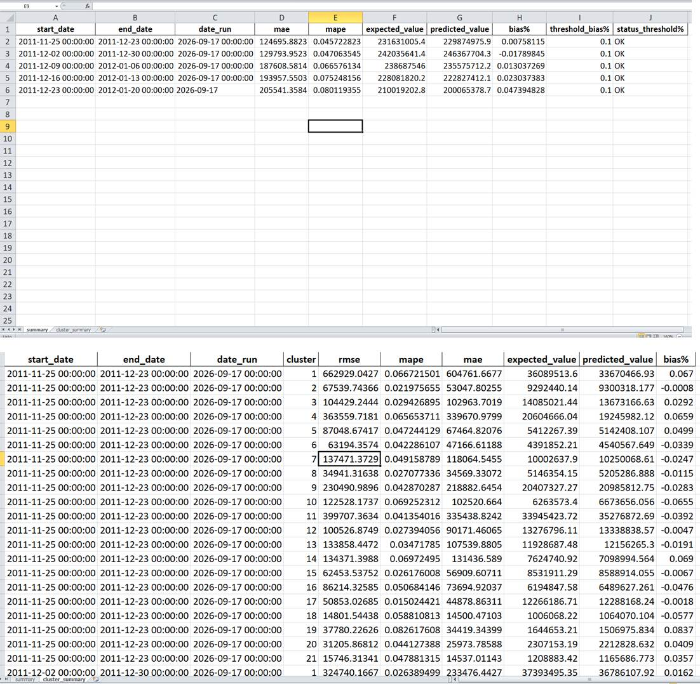
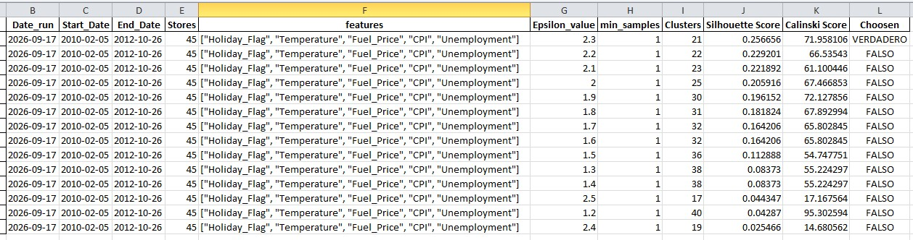
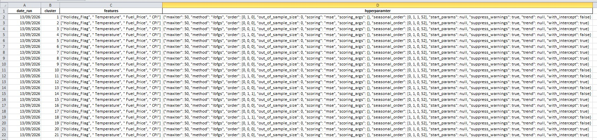
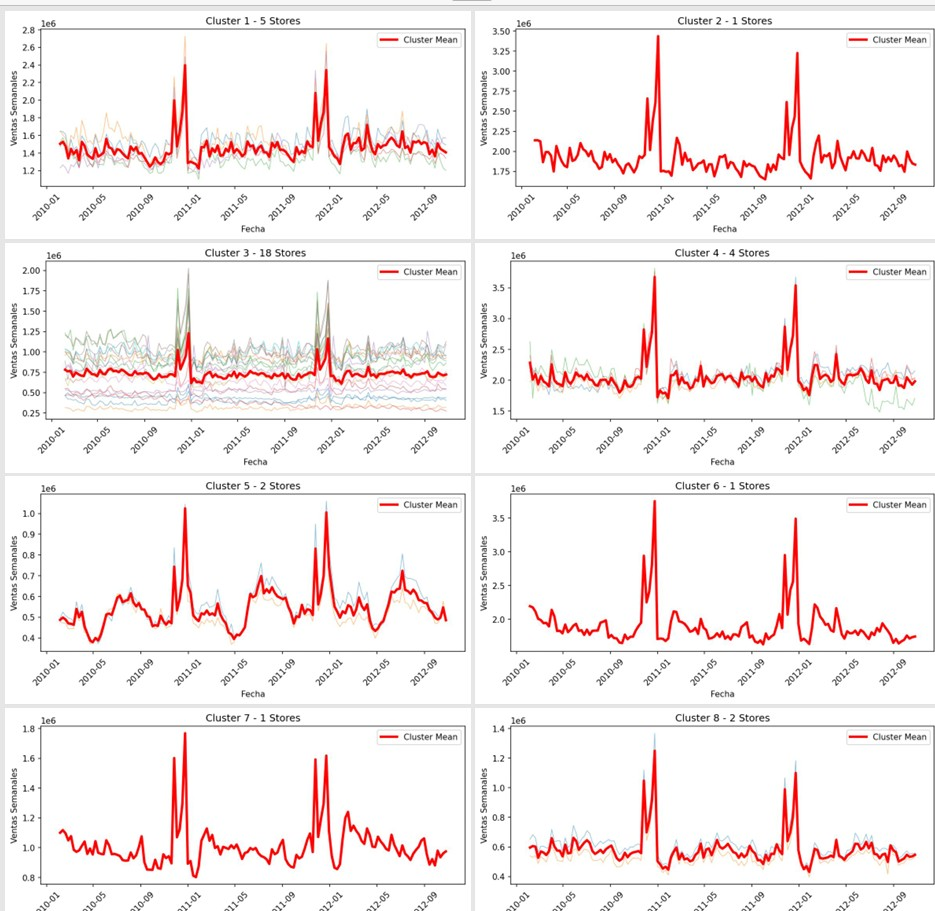
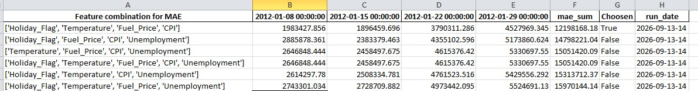
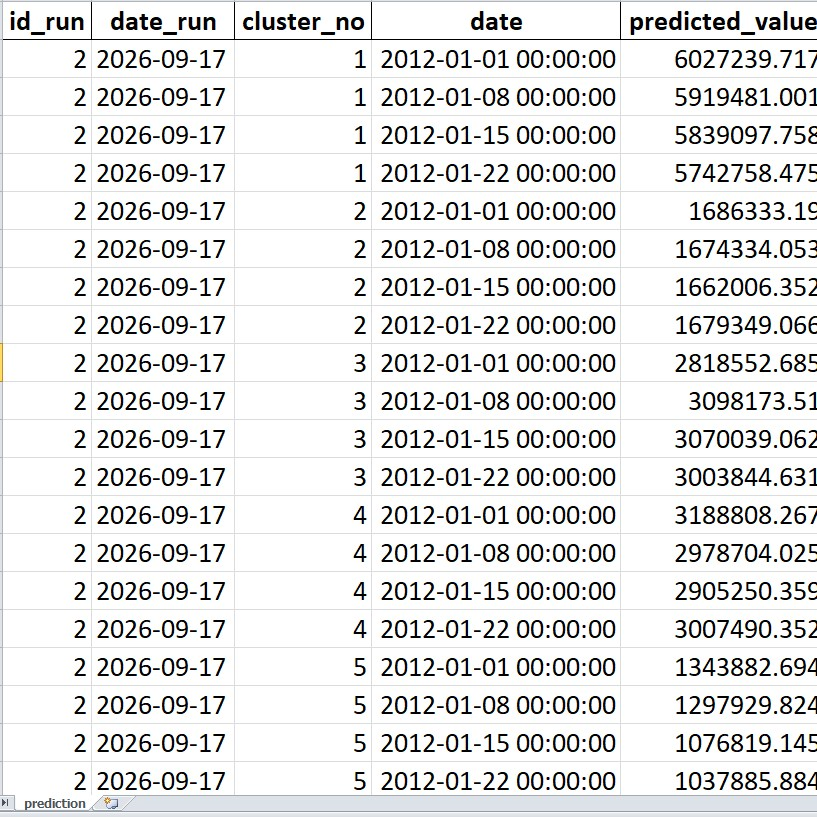

# 🎯 Project Goal
The objective of this project is to **predict future sales for 52 stores** in order to determine the **liquidity required**.

# 🔑 Key Highlights
- **DBSCAN Clustering**  
  Instead of creating a separate cluster for each store, we applied **DBSCAN** to group stores with similar sales trends. This reduces complexity and allows shared strategies across clusters.

- **SARIMA Forecasting**  
  For each cluster, we used **SARIMA models** to generate sales forecasts. This approach captures seasonality and trends, producing more accurate predictions for new sales data.

# ⚙️ Configuration Parameters

## Prediction Settings
- `startYearPrediction`: Base year for predictions  
- `StartWeekPredict`: Starting week of the first prediction  
- `NumberWeekPredict`: Number of weeks to predict (default: 4)  
- `BackTestingWeek`: Number of weeks used for backtesting in production (default: 4)  

> ⚠️ **Note**: Backtesting is set to 4 weeks. Adjusting these values is possible but not recommended, as the pipeline is optimized for this horizon.

## Workflow Flags
- `flag_cal_best_features` *(False by default)*  
  Runs feature combination evaluation.  
  - **Output**: `Feature_Selection.xlsx`  
  - *Note: This process may take up to 24 hours because it evaluates different feature combinations over a 4‑week horizon.*

- `flag_hyper_param_sarima` *(False by default)*  
  Recalculates SARIMA hyperparameters for each cluster if cluster assignment or feature selection changes.  
  - **Output**: `Cluster_Hyperparam_sarima.xlsx`  
  - *Note: Does not save historical hyperparameters (possible improvement).*

- `flag_cluster_assigment` *(False by default)*  
  Reassigns clusters.  
  - **Output**: `clust_hparam_eval.xlsx`  
  - *Note: Overwrites existing cluster evaluation. Currently uses all features for cluster creation.*

# 📂 Project Outputs
This project generates several files that capture different stages of the pipeline:

- **`clust_hparam_eval.xlsx`** – Cluster evaluation results and the cluster assigned to each store.  
- **`All_Clusters.pdf`** – PDF visualization showing the trend of each store within its assigned cluster.  
- **`backtesting_logs.xlsx`** – Backtesting results per store, plus a summary with thresholds to determine if the model is still performing well. Each new prediction run appends information here.  
- **`Cluster_Hyperparam_sarima.xlsx`** – SARIMA hyperparameters for each cluster.  
- **`Feature_Selection.xlsx`** – Feature combination evaluation. This file is used in production to filter which features to include.  
- **`model_prediction.xlsx`** – Prediction results for each run. The file includes identifiers (`id_run`, `date_run`) to track when predictions were generated.

# 📸 Sample Screenshots

Below are example outputs generated by the pipeline. These screenshots illustrate different stages of the workflow:

1. **Backtesting Results**  
     
   Shows backtesting per store and a summary with thresholds to determine if the model is still performing well. Each new prediction run appends information here.

2. **Cluster Evaluation**  
     
   Displays cluster evaluation results and the cluster assigned to each store.

3. **Cluster Hyperparameters**  
     
   Contains SARIMA hyperparameters for each cluster.

4. **Cluster Sales Trends**  
     
   Visualization showing the trend of each store within its assigned cluster.

5. **Feature Evaluation**  
     
   Shows feature combination evaluation. This file is used in production to filter which features to include.

6. **Production Predictions**  
     
   Displays prediction results for each run. Includes identifiers (`id_run`, `date_run`) to track when predictions were generated.

# 🗂️ Project Structure
1. **Parameters**  
   Handles configuration and parameter management for experiments.

2. **readCsv**  
   Responsible for reading and preprocessing raw CSV datasets.

3. **ClusterCreation**  
   - `ParameterCreation` – Generates parameters for clustering.  
   - `TrainingPredictCluster` – Trains clustering models and predicts cluster assignments.  
   - `ClusterGraphPDF` – Exports cluster visualizations in PDF format.  
   - `iterationChooseBestHyperParamet...` – Iteratively selects optimal hyperparameters for clustering.

4. **Principal Functions**  
   - `splitTrainingTest` – Splits data into training and test sets.  
   - `adjustingData` – Applies transformations and adjustments to datasets.  
   - `BestHyperparameters` – Identifies optimal hyperparameters for forecasting models.  
   - `exogenousCalculation` – Computes exogenous variables for time series models.  
   - `TrainingModelForecast` – Trains forecasting models (e.g., SARIMA).  
   - `Metrics` – Evaluates model performance using metrics such as MAE, RMSE, etc.

5. **BestFeatureSelection**  
   - `Iteration` – Iteratively tests feature combinations.  
   - `ExportFeaturesConfig` – Exports selected feature configurations.  
   - `ExportHyperParameterSarima` – Exports SARIMA hyperparameters.

6. **Production**  
   - `ReadFeatureSelection` – Loads feature selection results.  
   - `ReadClusterAssignment` – Loads cluster assignments.  
   - `ReadHyperParameterSarima` – Loads SARIMA hyperparameters.  
   - `ReadHistoricalPrediction` – Reads historical predictions.  
   - `NewDataPrediction` – Generates predictions for new incoming data.

7. **BackTesting**  
   - `NewHistoricalData` – Prepares new historical datasets for testing.  
   - `ReadBackTestingHistorical` – Loads historical backtesting data.  
   - `ExportHistoricalBackTesti...` – Exports backtesting results.
